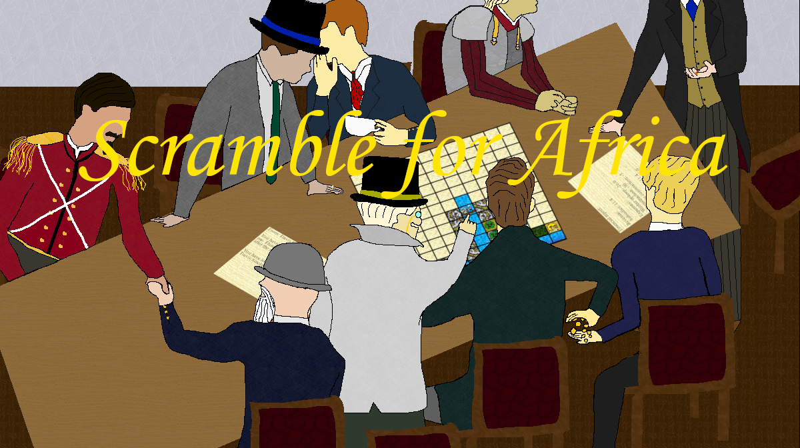

Scramble for Africa - a game simulating the European imperialist conquest of Africa

Welcome to Scramble for Africa! Your goal as colonial governor is to bring glory to your country's name by conquering and enlightening this hostile continent, hopefully becoming fabulously rich in the process. Your work will require close cooperation with your subordinate ministers - while some will accomplish whatever you ask, many will lie, steal, and swindle their way to glory, and the rest are just plain incompetent.

By putting the player behind the "wheel" of imperialism, this game seeks to convey the reasoning behind the lasting harm wrought by the European Great Powers, even those with better intentions, without attempting to justify or condone their actions. A variety of sensitive topics are covered, ranging from slavery and racism to conquest and genocide. Such elements exist solely to acknowledge the brutal practices of European imperialists and thereby respect and 
remember their victims.
